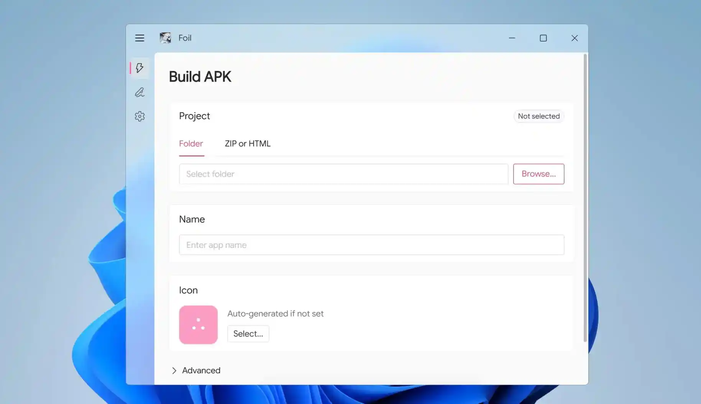

# Foil

[English](README.md) | 简体中文



从任意 HTML 项目构建自定义 Android APK 的桌面应用。基于 Go + Wails2。

**无需安装 Java / Android SDK** — 精简 JRE、Apktool、Apksigner、模板 APK 和签名密钥生成器全部内置。

---

## 功能

- **HTML 转 APK** — 选择包含 `index.html` 的本地文件夹，或上传 `.zip` / `.html` 文件
- **自定义元数据** — 应用名称、包名、版本号均可配置
- **应用图标** — 上传图片或自动生成首字母图标，支持正确 DPI 缩放
- **APK 签名**
  - 自动生成自签名证书（Go 实现，私钥 Windows DPAPI 加密存储）
  - 或使用自己的证书（通过内置 Android Apksigner 签名）
- **证书管理** — 跨会话记住证书路径/密码（Windows DPAPI 加密）
- **构建日志悬浮按钮** — 悬停查看构建输出，无需离开页面
- **双语界面** — 中文 / English
- **单文件分发** — 所有资源嵌入二进制，首次运行自动解出

---

## 快速开始

### 开发模式

```bash
# 安装 Wails CLI
go install github.com/wailsapp/wails/v2/cmd/wails@latest

# 克隆项目
git clone https://github.com/KaiZhou554/foil.git
cd foil

# 安装前端依赖
cd frontend && npm install && cd ..

# 启动开发模式
wails dev
```

### 构建发布版

```bash
wails build
```

编译后的 exe 和安装包位于 `build/bin` 目录。

---

## 技术栈

| 层 | 技术 |
|---|---|
| 桌面框架 | [Wails v2](https://wails.io)（Go + WebView2） |
| 前端 | Vue 3 + TypeScript + Vite + Naive UI + Pinia |
| APK 工具 | Apktool + Android Apksigner（均内置） |
| 证书加密 | Windows DPAPI（`CryptProtectData` / `CryptUnprotectData`） |
| Java 运行时 | 内置精简 JRE（jlink 裁剪，约 43 MB） |
| 桌面路径（Windows） | 从注册表 `HKCU\…\User Shell Folders\Desktop` 读取 |

---

## 项目结构

```
foil/
├── app.go                  # Wails 绑定的 API 方法
├── main.go                 # 入口，资源嵌入
├── certstorage.go          # DPAPI 加密证书存储
├── keytool.go              # 调用内置 keytool 列出证书别名
├── desktop_windows.go      # 注册表读取桌面路径
├── config/                 # TOML 配置管理
├── internal/
│   ├── builder/            # APK 构建流水线
│   │   ├── builder.go      # 编排器（Go 签名 & Apksigner）
│   │   ├── apktool.go      # Apktool 集成
│   │   ├── naming.go       # 包名 / 版本号生成
│   │   ├── icons.go        # 图标定义
│   │   ├── genkey.go       # 自动生成密钥对 + DPAPI 加密
│   │   └── zipalign.go     # 4 字节对齐
│   ├── dpapi/              # Windows DPAPI 绑定
│   └── apksigner/          # Go APK v1 + v2 签名库（用于自动证书）
├── frontend/
│   ├── src/
│   │   ├── pages/          # 首页、高级页、设置页、欢迎页
│   │   ├── components/     # UI 组件（侧栏、构建按钮、设置卡片…）
│   │   ├── stores/         # Pinia 状态管理
│   │   └── locales/        # 国际化（zh-CN, en）
│   └── wailsjs/            # Wails 自动生成的绑定
└── assets/                 # 内置资源
    ├── foil-example.apk    # 模板 APK
    ├── apksigner.jar       # Android Apksigner
    ├── apktool.jar         # Apktool
    └── jre-minimal/        # 精简 JRE
```

---

## 配置

配置文件保存在 `%APPDATA%\unieditdept\foil\config.toml`（Windows）。

| 键 | 默认值 | 说明 |
|---|---|---|
| `language` | `zh-CN` | 显示语言（`zh-CN` / `en`） |
| `outputDir` | 桌面 | APK 输出目录 |
| `showFloatButton` | `false` | 显示构建日志浮动按钮 |
| `openAfterBuild` | `true` | 构建后自动打开输出文件夹 |
| `useCustomCert` | `false` | 使用自定义证书而非自动生成 |
| `rememberLevel` | `off` | 证书记住级别（`off` / `path` / `full`） |
| `rememberCompany` | `false` | 记住公司名（包名第二段） |
| `companyName` | `""` | 存储的公司名称 |

---

## 许可

MIT
